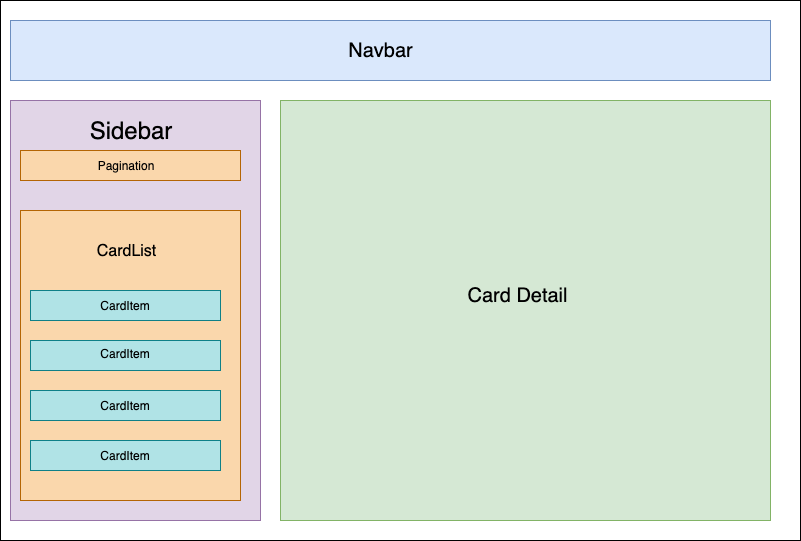

# Infinite Fox's Final Live Code (Phase 2) 👨‍💻👩‍💻

Pada live code ini, kamu diminta untuk membuat beberapa fitur baik dari sisi `server` maupun `client`. Pastikan kamu membaca spesifikasi dengan baik. Live code ini akan dicek dari sisi end user lalu dilanjutkan ke code review, jadi pastikan fitur yang kamu buat tidak setengah-setengah (`client` / `server` aja).
Adapun cara pengumpulan livecode ini adalah (***\*WAJIB\****):
1. Pastikan kamu sudah membuat `.gitignore` sehingga `node_modules` dan `.env`  tidak ter-commit ke github kalian
2. `open pull request` dengan title ***\*NAMA LENGKAP\****
3. Buatlah komentar pada pull request kalian berupa env variable yang digunakan beserta valuenya, serta kesulitan saat mengerjakan soal ini
4. Tambahkan comment yang berisi `environment variables` yang dipakai (beserta valuenya)
5. Pastikan nama `routes` ***\*SAMA\**** dengan instruksi soal
6. Pastikan nama `database` ***\*SAMA\**** dengan instruksi soal

> Jika tidak memberikan* **environment variable***, aplikasi error, maka hal ini bukan tanggung jawab instruktur ^^.

Aplikasi yang kamu buat harus SPA (Single Page Application). Nilai akan dikurangi 10 points jika ada `refresh/reload`

### Kompetensi

- Memahami Authentication pada client dan server
- Mampu menggunakan 3rd API dengan baik
- Implementasi Vue (CLI, Emit & Props, Router)
- Mampu membuat layout dan styling dengan CSS Framework
- Menguasai State Management Vuex

## Summary

Tujuan dari aplikasi ini adalah untuk menampilkan daftar kartu yang tersedia sesuai page yang dipilih, menampilkan detail jika sidebar kartu di click dan menyimpan *cardlist* milik user. 

## Release 0 - Register & Login
Buatlah proses authentication register & login di aplikasi ini. dalam proses ini kalian ***\*WAJIB\**** melakukan proses **hash password** dan **generate token** di sisi server dan menggunakan **Vuex** di sisi client. **Untuk proses register tidak perlu dibuat di sisi client**

- **Register** 
  - URL:
    - `POST /register`
  - Body:
    - `email`: `String`, required
    - `password`: `String`, required
  - Expected response (status: `201`):
    ```json
      {
        "_id": "...",
        "email": "...",
        "password": "<HashedPassword>"
      }
    ```
  - Notes:
    - Handle juga error untuk email duplikat dan input tidak valid seperti email/password tidak diisi (status: `400`).
    - **Tidak perlu** dibuat di sisi `client`.

- **Login** 
  - URL:
    - `POST /login`
  - Body:
    - `email`: `String`, required
    - `password`: `String`, required
  - Expected response (status: `200`):
    ```json
      {
        "access_token": "<accessToken>"
      }
    ```
  - Notes:
    - Handle juga error untuk input tidak valid (email/password tidak diisi atau salah).
    - Di sisi `client`, untuk menyimpan *login state* (sedang login atau tidak) **HARUS** di Vuex/store.

## Release 1 - Fetch Data
Aplikasi ini menggunakan data `card` dari 3rd Party API yang kita gunakan. Baca dokumentasi berikut untuk lebih lengkapnya [berikut](https://infiniteyugioh.docs.apiary.io).

**Server**
- READ ALL CARD IN Page

Di sisi `client`, kamu tidak diperbolehkan untuk menyimpan data `Cards` di Vuex/store, simpanlah di komponen bernama `Sidebar`. Lihatlah gambar berikut supaya lebih jelas:



Notes:
- Nama komponen tidak harus mengikuti gambar di atas, contoh layout-nya saja.
- Sususan komponen harus **SAMA PERSIS** seperti gambar di atas!

<hr/>

- **Card list in Page**
  - URL:
    - `GET /cards/page/:page`
  - Header(s):
    - `access_token`: `String`
  - Params:
    - `page`: `Number`
  - Expected response (status: `200`):
    ```json
      {
        "cards": [
            {
                "card_number": "...",
                "name": "...",
                "rarity": "..."
            }
        ]
    }
    ```
  - Notes:
    - Handle error untuk header tidak valid seperti `Invalid access token` (status: `400`).

- **Get card detail** 
  - URL:
    - `GET /cards/detail/:card_number`
  - Header(s):
    - `access_token`: `String`
  - Params:
    - `card_number`: `String`
  - Expected response (status: `200`):
    ```json
      {
        "msg": "Card found",
        "card": {
            "name": "Elemental HERO Air Neos",
            "price": 110,
            "price_shift": 0,
            "card_number": "STON-EN034",
            "card_set": "Strike of Neos",
            "rarity": "Ultimate Rare",
            "img": "https://static-3.studiobebop.net/ygo_data/card_images/Elemental_HERO_Air_Neos.jpg"
        }
    }
    ```
  - Notes:
    - Handle error untuk header tidak valid seperti `Invalid access token` (status: `400`).
    - Handle error untuk status `404` ketika card_number yang dicari tidak ada.
    - Gunakan endpoint ini untuk menampilkan detail di `client`.

## Release 2 - Create Card List && Delete Card from list
Aplikasi ini menggunakan data `card` dari 3rd Party API yang kita gunakan.

- **Create a card** 
  - URL:
    - `POST /cards/collection`
  - Header(s):
    - `access_token`: `String`
  - Body:
    - `name`: `String`, required
    - `price`: `Number`, required
    - `price_shift`: `Number`, required
    - `card_number` : `String`, required
    - `card_set` : `String`, required
    - `rarity` : `String`, required
    - `img` : `String`, required

  - Expected response (status: `201`):
    ```json
      {
        "msg": "success adding card",
        "card": {
            "_id": "5da9387547ab000f5fc7871c",
            "name": "Elemental HERO Air Neos",
            "price": 110,
            "price_shift": 0,
            "card_number": "STON-EN034",
            "card_set": "Strike of Neos",
            "rarity": "Ultimate Rare",
            "img": "https://static-3.studiobebop.net/ygo_data/card_images/Elemental_HERO_Air_Neos.jpg",
            "ownerId": "5da1a64aa224d5162998fcac",
            "__v": 0
        }
    }
    ```
  - Notes:
    - Handle error untuk header tidak valid seperti `Invalid access token` dan input yang tidak valid (status: `400`).
    - Tampilan di `client` harus langsung ter-update ketika data berhasil dibuat (muncul data baru) dan tidak boleh *refresh*/*reload*.
    - Terdapat validasi, maksimal 3 kartu dengan rarity yang sama, tapi jumlah kartu yang bisa dimiliki user tak terbatas. 
    - Handle notifikasi dari error response / success response yang didapat dari server di client

- **Get card collections**
  - URL:
      - `GET /cards/collection`
    - Header(s):
      - `access_token`: `String`
    - Expected response (status: `200`):
      ```json
        [
          {
              "_id": "5da1a857af95b316b43421e8",
              "name": "Solemn Judgment",
              "price": 35,
              "price_shift": 0,
              "card_number": "RP01-EN045",
              "card_set": "Retro Pack",
              "rarity": "Super Rare",
              "img": "https://static-3.studiobebop.net/ygo_data/card_images/Solemn_Judgment.jpg",
              "ownerId": "5da1a64aa224d5162998fcac",
              "__v": 0
          },
      ]
      ```
    - Notes:
      - Handle error untuk header tidak valid seperti `Invalid access token` (status: `400`).

- **Delete a card** 
  - URL:
    - `DELETE /cards/collection/:id`
  - Header(s):
    - `access_token`: `String`
  - Params:
    - `id`: `String id card yang akan di delete`
  - Expected response (status: `200`):
    ```json
      {
        "message": "Delete from collection success",
        "_id": "deleted id"
      }
    ```
  - Notes:
    - Handle error untuk header tidak valid seperti `Invalid access token` (status: `400`).
    - Handle error untuk status `404` ketika ID yang dicari tidak ada.
    - Tampilan di `client` harus langsung ter-update ketika data berhasil dihapus (data hilang) dan tidak boleh *refresh*/*reload*.
